**Задача 1:**
https://hub.docker.com/r/decimal0netology/custom-nginx

**Задача 2:**
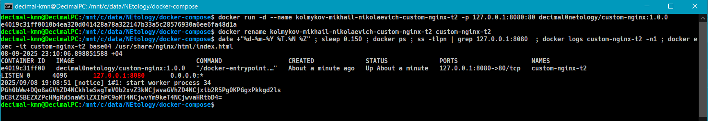

**Задача 3:**
Контейнер останавливается, потому что был послана команда на остановку процесса. В контейнере это главный процесс с пидом 1 это энджинкс. Вот он и завершился. Ну типа, докер обслуживает только один главный процесс. Который через cmd или entrypoint запускается. Котнрол С как раз убивает этот главный процесс nginx  и контейнеру (у которого и было основное назначение nginx) больше делать нечего, поэтому он останавливается. 
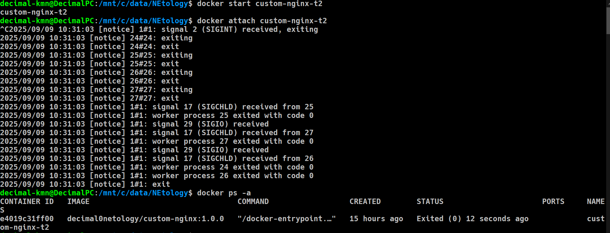

Мы заменили порт в конф файле nginx, теперь он слушает не 80, а 81 порт.
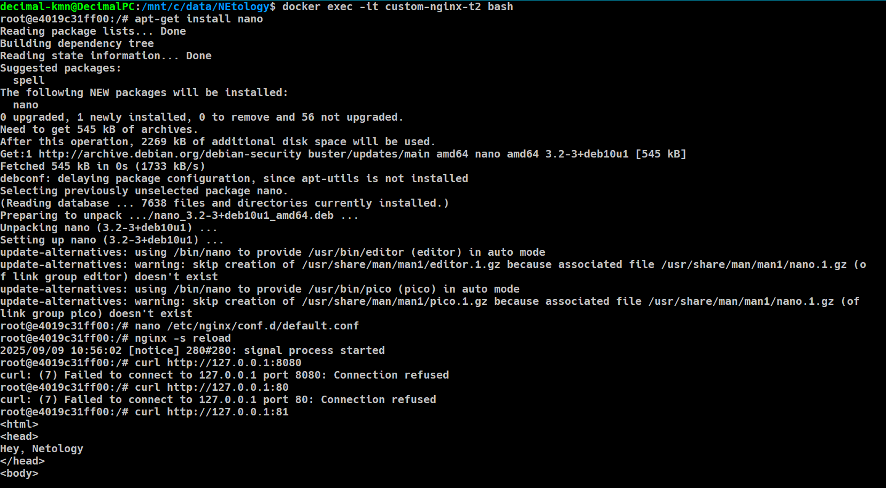

Докер пробрасывает порты 8080:80, но мы поменяли в контейнере порт nginx на 81, поэтому и не работает. Либо надо в зад вернуть в конф файле, либо пересоздать контейнер с нужным пробросом портов.

можно через коммит сделать другой контейнер:
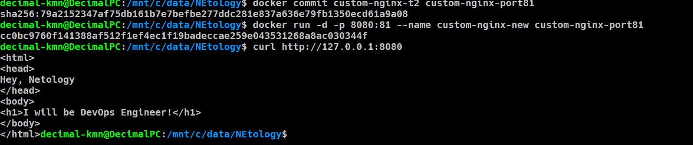

Можно остановить контейнер, докер, зайти на хосте в докер, в containers, по id зайти в конфиги контейнера, поменять в json конфигах portbindigs на порт 81 и обратно все запустить. Вроде работает.
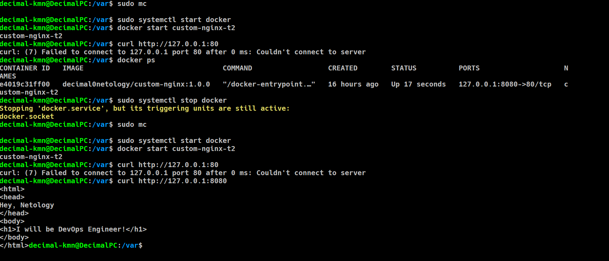

Удалили контейнер:
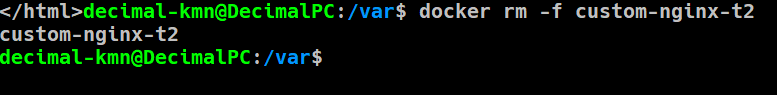

**Задача 4:**
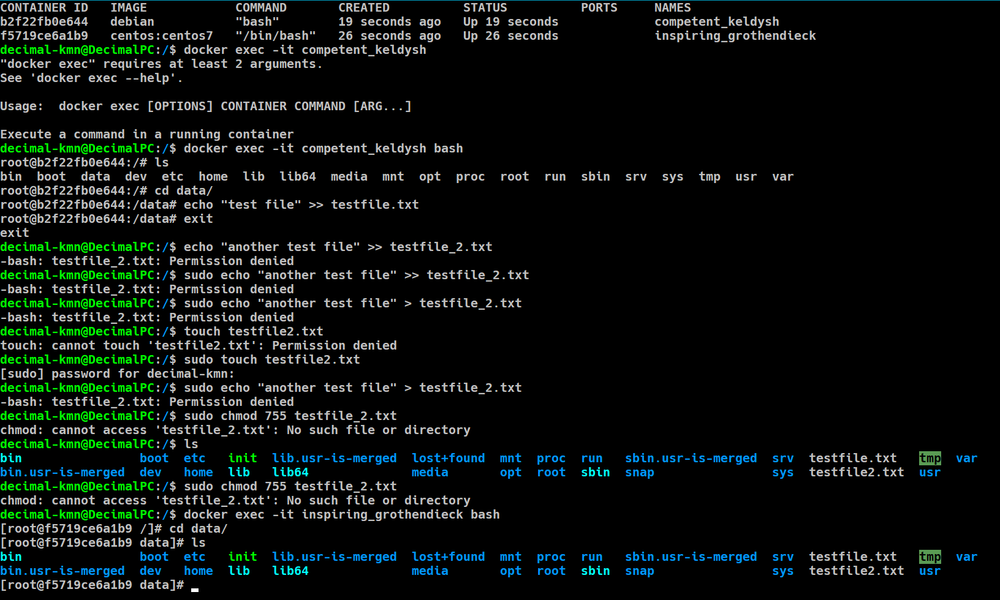

**Задача 5:**
Если есть оба файла, то сначала compose.yaml согласно докам
делаем include в compose.yaml другого файла
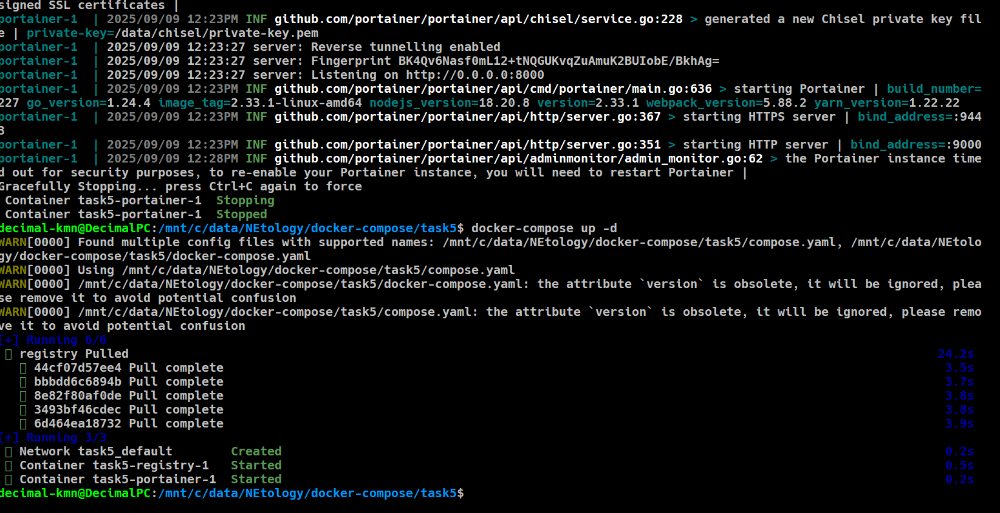

**compose.yaml:**
version: "3"

include:
  - docker-compose.yaml
services:
  portainer:
    network_mode: host
    image: portainer/portainer-ce:latest
    volumes:
      - /var/run/docker.sock:/var/run/docker.sock

Запушили в локальный registry:
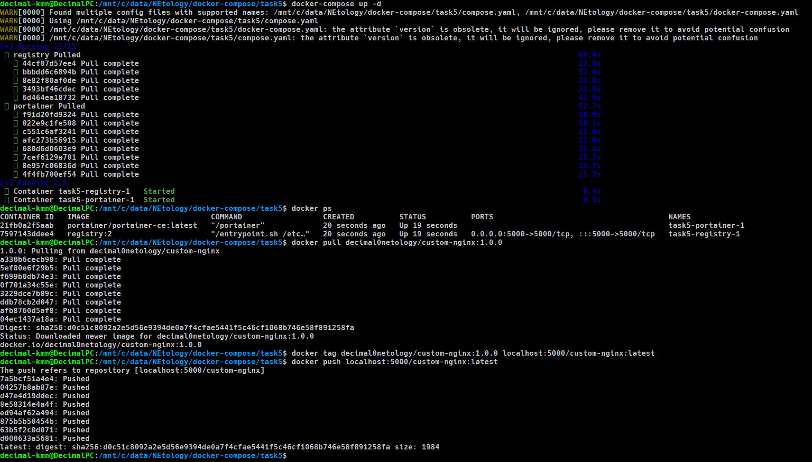

Deployed compose:
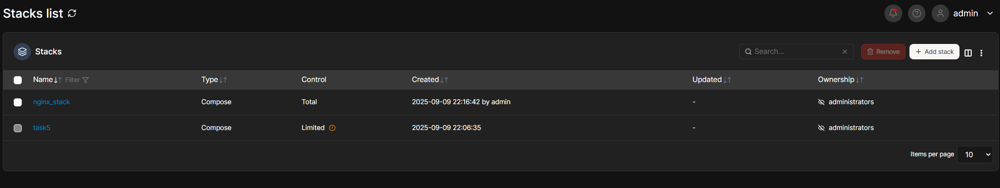

inspect screenshot:
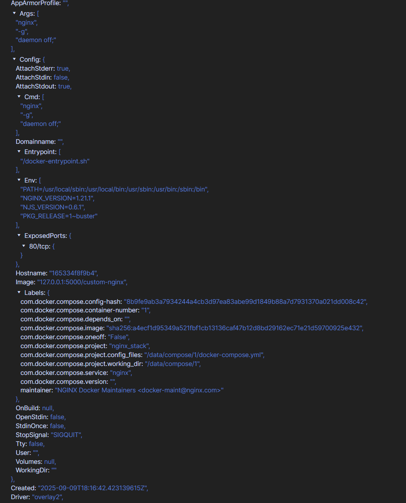

Гасим проект:
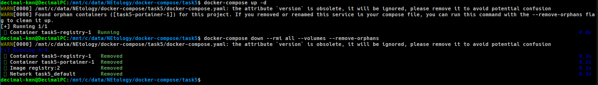

